# Lab 01- Introduction to Docker
---

### Lab Steps

- [Step 1: Installation of Docker on Windows (Using Docker desktop)](#step-1-installation-of-docker-on-windows-using-docker-desktop)
- [Step 2: Getting started with Docker](#step-2-getting-started-with-docker)
  - [Test your Docker installation](#test-your-docker-installation)
  - [Starting the "Hello World" container](#starting-the-hello-world-container)
  - [Getting Docker Help](#getting-docker-help)
  - [Exploring a sample Docker application](#exploring-a-sample-docker-application)
  - [Set up tab Auto-completion for Docker commands in PowerShell](#set-up-tab-auto-completion-for-docker-commands-in-powershell)


# Step 1: Installation of Docker on Windows (Using Docker desktop)

**Docker Desktop for Windows** is the Community version of Docker for Microsoft Windows. You can download Docker Desktop for Windows from [Docker Hub](https://hub.docker.com/editions/community/docker-ce-desktop-windows/).
The Docker Desktop installation includes [Docker Engine](https://docs.docker.com/engine/), Docker CLI client, [Docker Compose](https://docs.docker.com/compose/), [Notary](https://docs.docker.com/notary/getting_started/), [Kubernetes](https://github.com/kubernetes/kubernetes/), and [Credential Helper](https://github.com/docker/docker-credential-helpers/).

**_System Requirements_**
- Windows 10 64-bit: Pro, Enterprise, or Education (Build 15063 or later).
- Hyper-V and Containers Windows features must be enabled.
- The following hardware prerequisites are required to successfully run Client Hyper-V on Windows 10:

  - 64 bit processor with [Second Level Address Translation (SLAT)](http://en.wikipedia.org/wiki/Second_Level_Address_Translation)
  - 4GB system RAM
  - BIOS-level hardware virtualization support must be enabled in the BIOS settings. For more information, see [Virtualization](https://docs.docker.com/docker-for-windows/troubleshoot/#virtualization-must-be-enabled).
  
   > Docker Desktop is not available for Windows Home edition because Hyper-V is not available on Windows Home editions. In this case, install the [Docker ToolBox](https://docs.docker.com/toolbox/toolbox_install_windows/). It installs installs everything, Oracle Virtualbox, a VM (docker machine), and clients.

**_Checking if Hyper-V is enabled_**

To check if Hyper-V is enabled:
 - Go to **Windows Start Button -> Turn Windows features on or off**
  
  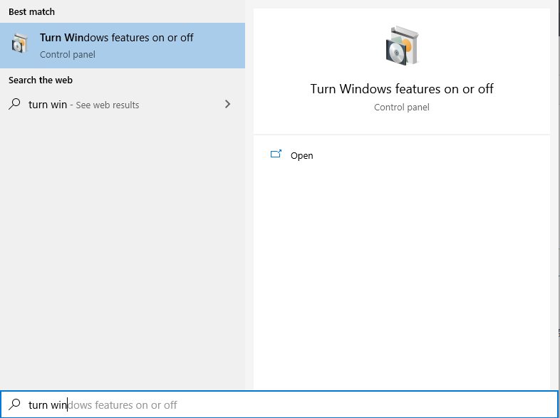

 - Check if Hyper-V Hypervisor is enabled. If it is not enabled, enable it.
 
 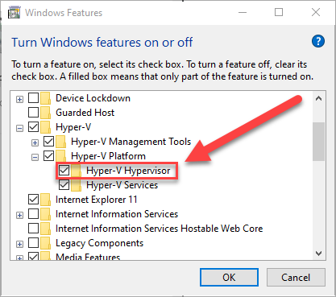

**_Installation steps_**

1. Double-click **Docker Desktop Installer.exe** to run the installer.
2. Follow the instructions on the installation wizard to accept the license, authorize the installer, and proceed with the install.
When prompted, authorize the Docker Desktop Installer with your system password during the install process. Privileged access is needed to install networking components, links to the Docker apps, and manage the Hyper-V VMs.
3. Click **Finish** on the setup complete dialog and launch the Docker Desktop application.

**_Start Docker Desktop_**

Docker Desktop does not start automatically after installation. To start Docker Desktop, search for Docker, and select Docker Desktop in the search results.

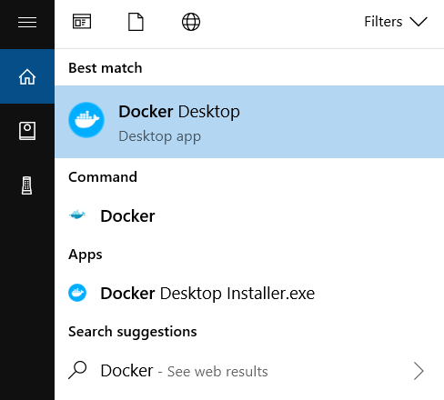

When the whale icon in the status bar stays steady, Docker Desktop is up-and-running, and is accessible from any terminal window.


If the whale icon is hidden in the Notifications area, click the up arrow on the taskbar to show it. 
After installing the Docker Desktop app, you also get a pop-up success message with suggested next steps, and a link to this documentation.

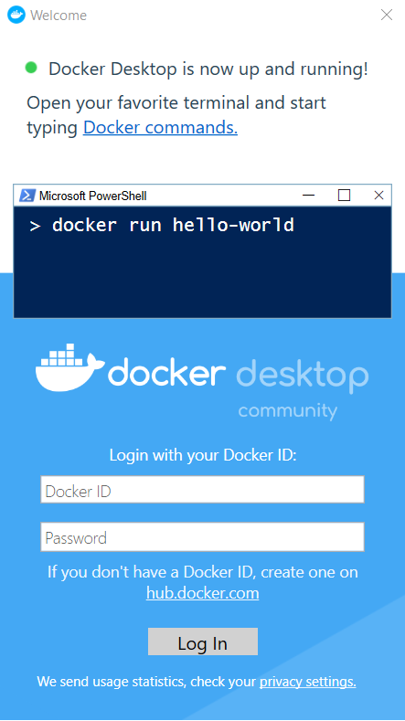

When initialization is complete, click the whale icon in the Notifications area and select About Docker Desktop to verify that you have the latest version.
 - Sign in to [Dockerhub](https://hub.docker.com).  If you don't have a DockerID, create on.
Congratulations! You are successfully running Docker Desktop on Windows.

**_Settings of Docker_**

In the taskbar you should be able to see Docker icon and hovering over it should show the status of Docker. After right click on the Docker icon you can go to Settings for configuration of Docker VM:

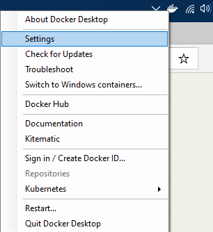

In the Advanced settings tab, you can configure the CPU and Memory configuration of Docker.

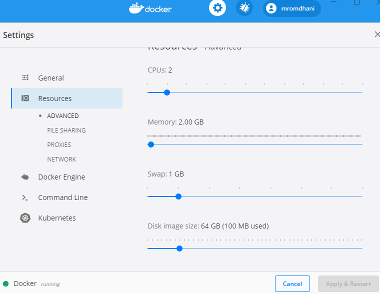

> Note: all of the above settings, are applied to VM visible in Hyper-V Manager.
> 
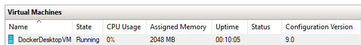

After right click on DockerDesktopVM and selecting Settings, the following window will appear.

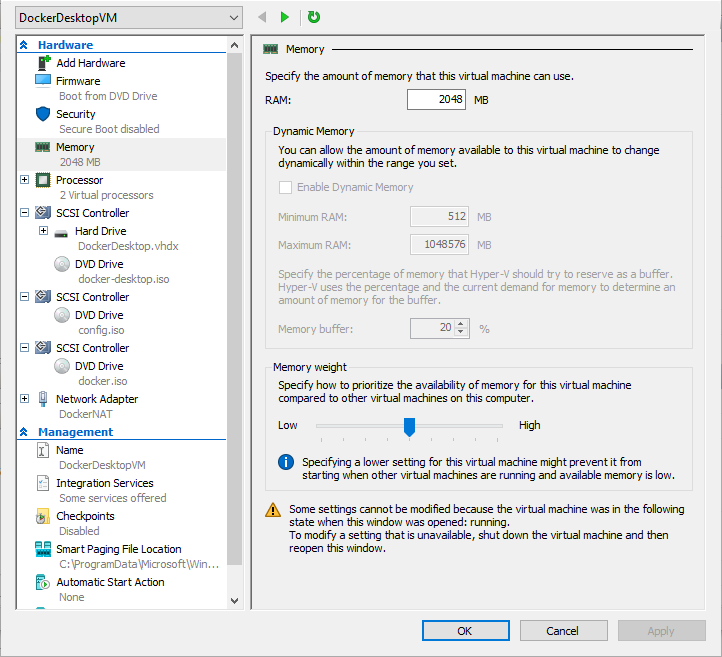

# Step 2: Getting started with Docker

## Test your Docker installation

1. Open a terminal window (Command Prompt or PowerShell).
2. Run `docker version` to display the of Docker Client and Engine version:

    ```
    $ docker version
    Client: Docker Engine - Community
    Version:           19.03.8
    API version:       1.40
    Go version:        go1.12.17
    Git commit:        afacb8b
    Built:             Wed Mar 11 01:23:10 2020
    OS/Arch:           windows/amd64
    Experimental:      false

    Server: Docker Engine - Community
    Engine:
    Version:          19.03.8
    API version:      1.40 (minimum version 1.12)
    Go version:       go1.12.17
    Git commit:       afacb8b
    Built:            Wed Mar 11 01:29:16 2020
    OS/Arch:          linux/amd64
    Experimental:     false
    containerd:
    Version:          v1.2.13
    GitCommit:        7ad184331fa3e55e52b890ea95e65ba581ae3429
    runc:
    Version:          1.0.0-rc10
    GitCommit:        dc9208a3303feef5b3839f4323d9beb36df0a9dd
    docker-init:
    Version:          0.18.0
    GitCommit:        fec3683 
    ```
3. Run `docker-compose version` to display the of Docker Client and Engine version:
   ```shell
    $ docker-compose version
    docker-compose version 1.25.4, build 8d51620a
    docker-py version: 4.1.0
    CPython version: 3.7.4
    OpenSSL version: OpenSSL 1.1.1c  28 May 2019
    ```
    
##  Starting the "Hello World" container

1. Pull the [hello-world image](https://hub.docker.com/r/library/hello-world/) from Docker Hub and run a container:
  ``` shell
   $ docker pull hello-world
   ```
 Start the hello-world container. If the image was not pulled, Docker will pull it before starting the container since the image is required for the container. 

   ``` shell
  $ docker run hello-world

   docker : Unable to find image 'hello-world:latest' locally
   latest: Pulling from library/hello-world
   1b930d010525: Pull complete
   Digest: sha256:c3b4ada4687bbaa170745b3e4dd8ac3f194ca95b2d0518b417fb47e5879d9b5f
   Status: Downloaded newer image for hello-world:latest

   Hello from Docker!
   This message shows that your installation appears to be working correctly.
   ...
   ```

   You notice that the container starts successfully and displays the Hello from Docker! message.

2. List the `hello-world` image that was downloaded from Docker Hub:

   ```shell
   $ docker image ls
   ```
3. List the `hello-world` container (that exited after displaying "Hello from Docker!"):

   ```shell
   $ docker container ls --all
   ```

##  Getting Docker Help

Explore the Docker help pages by running some help commands:
   
   ```shell
   $ docker help

   ```
   Getting help about containers:
   ```   
   $ docker container help
   $ docker container ls help
   $ docker run --help  # This command is the old form of docker conatiner run
   ```
   Getting help about images:
   ```   
   $ docker image --help
   $ docker image ls --help
   $ docker images --help
   ```
## Exploring a Docker application

In this section, we demonstrate the ease and power of Dockerized applications by running something more complex, such as an OS and a webserver.

1. Pull an image of the [Ubuntu OS](https://hub.docker.com/r/_/ubuntu/) and run an interactive terminal inside the spawned container:
   ```shell
    $ docker run --interactive --tty ubuntu bash
    docker : Unable to find image 'ubuntu:latest' locally
    latest: Pulling from library/ubuntu
    22e816666fd6: Pull complete
    079b6d2a1e53: Pull complete
    11048ebae908: Pull complete
    c58094023a2e: Pull complete
    Digest: sha256:a7b8b7b33e44b123d7f997bd4d3d0a59fafc63e203d17efedf09ff3f6f516152
    Status: Downloaded newer image for ubuntu:latest
   ```
   > Note: The `-interactive`  (also shortened with `-i`) option runs an intercative container and `--tty`  (also shortened with `-t`)attaches a terminal connection to the container.  These two options are usually grouped together in the form of `-it`. Interactive containers keep running as long as the command inside is running. 

2. You are in the container. At the root # prompt, check the hostname of the container:
    ``` shell
    root@8aea0acb7423:/# hostname
    8aea0acb7423
    ```
  Notice that the `hostname` is assigned as the container ID (and is also used in the prompt).

3. Exit the shell with the exit command (which also stops the container):
    ```shell
    root@8aea0acb7423:/# exit 
    ```
4. List containers with the `--all` option (because no containers are running).

   The `hello-world` container (randomly named, `relaxed_sammet`) stopped after displaying its message. The `ubuntu` container (randomly named, `laughing_kowalevski`) stopped when you exited the container.

    ```shell
    $ docker container ls --all

    CONTAINER ID    IMAGE          COMMAND     CREATED          STATUS                      PORTS    NAMES
    8aea0acb7423    ubuntu         "bash"      2 minutes ago    Exited (0) 2 minutes ago             laughing_kowalevski
    45f77eb48e78    hello-world    "/hello"    3 minutes ago    Exited (0) 3 minutes ago             relaxed_sammet
    ```

5. Pull and run a Dockerized [nginx](https://hub.docker.com/_/nginx/) web server that we name, `webserver`:

    ```shell
    $ docker run --detach --publish 80:80 --name webserver nginx

    Unable to find image 'nginx:latest' locally
    latest: Pulling from library/nginx

    fdd5d7827f33: Pull complete
    a3ed95caeb02: Pull complete
    716f7a5f3082: Pull complete
    7b10f03a0309: Pull complete
    Digest: sha256:f6a001272d5d324c4c9f3f183e1b69e9e0ff12debeb7a092730d638c33e0de3e
    Status: Downloaded newer image for nginx:latest
    dfe13c68b3b86f01951af617df02be4897184cbf7a8b4d5caf1c3c5bd3fc267f
    ```

6. Point your web browser at `http://localhost` to display the nginx start page. (You don't need to append `:80` because you specified the default HTTP port in the `docker` command.)


7. List only your running containers:
    ```shell
      $ docker container ls

      CONTAINER ID    IMAGE    COMMAND                   CREATED          STATUS          PORTS                 NAMES
      0e788d8e4dfd    nginx    "nginx -g 'daemon of…"    2 minutes ago    Up 2 minutes    0.0.0.0:80->80/tcp    webserver
    ``` 

8. Stop the running nginx container by the name we assigned it, webserver:
    ```shell
    $  docker container stop webserver
    ```

9. Remove all three containers by their names -- the latter two names will differ for you:

   ```shell
   $ docker container rm webserver laughing_kowalevski relaxed_sammet
   ```
   
## Set up tab Auto-completion for Docker commands in PowerShell

If you would like to have handy tab completion for Docker commands, you can install the [posh-docker](https://github.com/samneirinck/posh-docker) PowerShell Module as follows.

1. Start an "elevated" PowerShell (i.e., run it as administrator).

   To do this, run PowerShell as administrator. When asked if you want to allow this app to make changes to your device, click **Yes**, and issue the following command:

   ```shell
   # allow remote signed scripts to run
   Set-ExecutionPolicy RemoteSigned
   ```
2. You can now close the Administrator command window and open a normal user PowerShell command window. To install the Docker Completion module, issue this command:
   ```shell
   # install Docker completion
   Install-Module posh-docker -Scope CurrentUser
   ```
   And finally, to activate the module in your current Power Shell window, use this command:
   ```
   # enable Docker completion
   Import-Module posh-docker
   ```
  To make auto completion persistent over all your PowerShell sessions, add it to your profile. To do this just use the following PowerShell Command.

   ```shell
   if (-Not (Test-Path $PROFILE)) {
      New-Item $PROFILE -Type File -Force
   }
   Add-Content $PROFILE "`nInstall-Module posh-docker"
   ```
   
   ##  Configure Commander (Cmder)
 [Cmder](https://cmder.net/), pronounced "Commander", is a pre-configured software package that provides you with an awesome terminal emulator on Windows. 
 One of the interesting features is to have many tabs of the terminal in one place.You can't find this (at least not now) in Windows Command Prompt and Powershell. You can also rename the tabs to give you better context.

 **_Cmder Installation_**
   1. Download the full package of Cmder [latest release](https://github.com/cmderdev/cmder/releases/).
   2. Extract the archive to a location on your filesystem.
   3. Place the installation location into your PATH.
   4. Run Cmder (Cmder.exe) 
  
  **_Some configurations_**
   Cmder has many settings to play around with. Something you may configure is putting the tabs on top instead of the bottom. To do so, right click on the programs navigation bar, choose settings, select tab bar and uncheck tab bar at the bottom setting. As can be seen, the settings menu has many options. Feel free to explore and customize to your liking.
   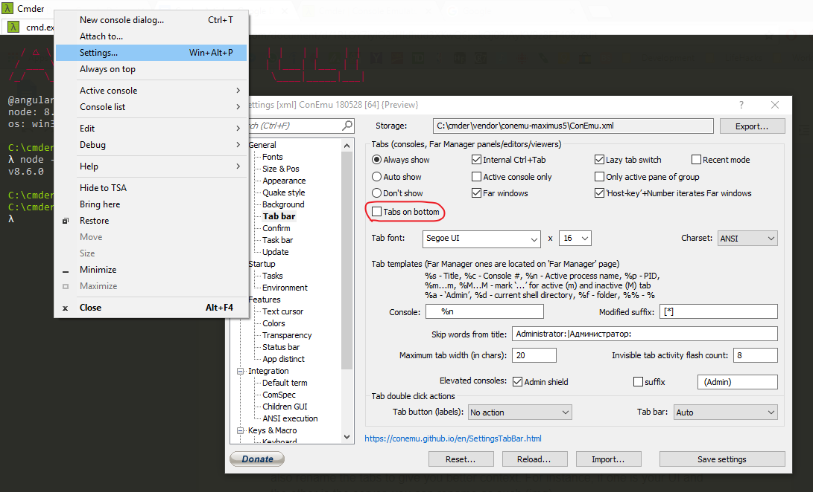
   You can also change the emulator of the terminal in the settings in the top right to Powershell, Bash, etc., search for a string, and switch between the many tabs running.
   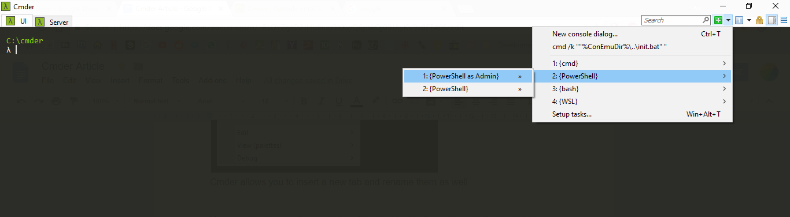
   
   Cmder comes out of the box with the PowerShell tasks configured with the `-NoProfile` option. This way, the auto complete configuration for Docker is lost.  You can fix this through the settings gui by removing the `-NoProfile` (highlighted in yellow in the figure below):
 
   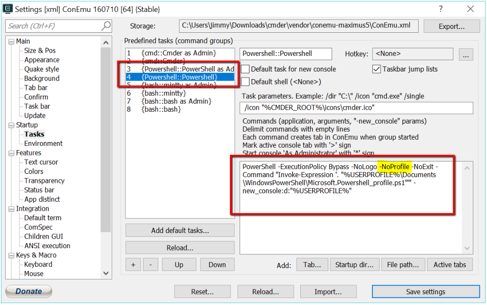 