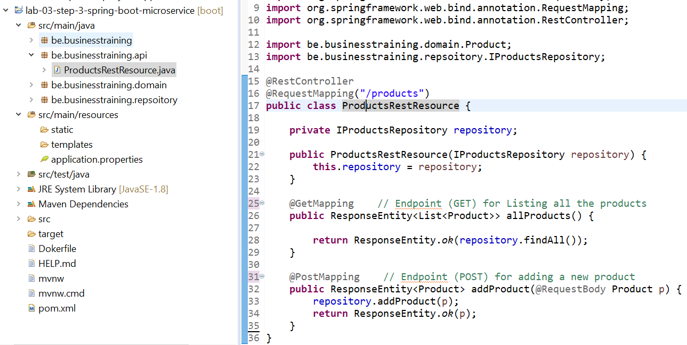
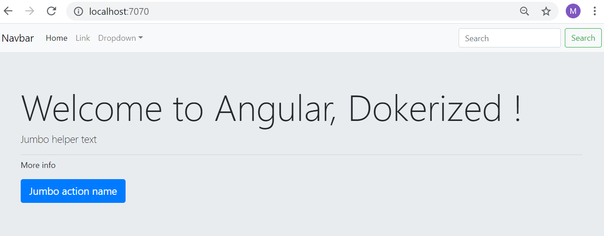

# Lab 03- Creating custom images
---


### Lab Steps

- [Step 1. Creating an Hello World Image](#step-1-creating-an-hello-world-image)
  - [Hello Dokerfile](#hello-dokerfile)
  - [ENTRYPOINT vs CMD](#entrypoint-vs-cmd)
- [Step 2. Dockerizing a simple Java application](#step-2-dockerizing-a-simple-java-application)
- [Step 3. Dockerize a Simple Spring Boot microservice](#step-3-dockerize-a-simple-spring-boot-microservice)
- [Step 4. Dockerize a Spring Boot microservice with multi-stages builds](#step-4-dockerize-a-spring-boot-microservice-with-multi-stages-builds)
- [Step 5. Dockerize a Spring Boot microservice with MySQL Database](#step-5-dockerize-a-spring-boot-microservice-with-mysql-database)
- [Step 6. Dockerize an angular frontal web application](#step-6-dockerize-an-angular-frontal-web-application)

<div style="page-break-after: always"></div>

# Step 1. Creating an Hello World Image
Docker makes it easier to create and deploy applications in an isolated environment. A Dockerfile is a script that contains collections of commands and instructions that will be automatically executed in sequence in the docker environment for building a new docker image.
In this step, You will learn how to create your own docker image with a dockerfile.

## Hello Dokerfile

- Create a folder named `Hello-world-image`. 
   ```shell
  $ mkdir hello-world-image (create our app folder)
   ```
- Move into that folder and create a file named `Dokerfile`. 
  ```shell
  $ cd hello-world-image (lets go into our folder)
  $ code Dockerfile    # Create a file called Dockerfile using the VS Code Editor. Be careful, Dokerfile name is case sensitive !
  ```
- Paste the following content in the `Dokerfile` file. 
  ```shell
  FROM alpine
  CMD ["echo", "Hello World, this is my image !"]
  ```
  This will instruct Docker to build an image based on Alpine (`FROM`), a minimal distribution for containers, and to run a specific command (`CMD`) when executing the resulting image.
- Build and run it:
  ```shell
  $ docker build -t hello .
  $ docker run --rm hello
  ```
  This will output:
  ``` shell
  Hello World, this is my image !
  ```

## ENTRYPOINT vs CMD

  If you only specify `CMD` then docker will run that command using the default `ENTRYPOINT`, which is `/bin/sh -c`.  If you specify both, then the `ENTRYPOINT` specifies the executable of your container process, and `CMD` will be supplied as the parameters of that executable.

For example if your Dockerfile contains
```shell
FROM alpine
CMD ["/bin/date"]
```
Then you are using the default `ENTRYPOINT` directive of `/bin/sh -c`, and running `/bin/date` with that default entrypoint. The command of your container process will be `/bin/sh -c /bin/date`. Once you run this image then it will by default print out the current date.
```shell
$ docker run test /bin/hostname
ce0274ec8820
```
If you specify an `ENTRYPOINT` directive, Docker will use that executable, and the `CMD` directive specifies the default parameter(s) of the command. So if your Dockerfile contains:
```shell
FROM alpine
ENTRYPOINT ["/bin/echo"]
CMD ["Hello"]
```
Then running it will produce
```shell
Hello
```
You can provide different parameters if you want to, but they will all run `/bin/echo`
```shell
$ docker run --rm test Hi
Hi
```
If you want to override the entrypoint listed in your Dockerfile (i.e. if you wish to run a different command than echo in this container), then you need to specify the `--entrypoint` parameter on the command line:

```shell 
$ docker run --entrypoint=/bin/hostname test
b2c70e74df18
```
  > Generally you use the `ENTRYPOINT` directive to point to your main application you want to run, and `CMD` to the default parameters.

# Step 2. Dockerizing a simple Java application

Let's consider a simple Java Console application that adheres to maven conventions. It is provided in the folder `lab-03-step-2-simple-java-app`. The goal to build it first and to dockerize its out `jar` artifact.

- Navigate to the folder  `lab-03-step-2-simple-java-app` containing the application
- Build the application in order to produce a `jar` file. Use the following **Windows Powershell** command. `--rm` option removes the container when it finishes its work, `-v` specifies the mount point and `-w` option specifies the work directory within the container.  
```
$ docker run --rm -v ${pwd}:/opt/maven -w /opt/maven maven:3.3.9-jdk-8 mvn clean package
```
- Check that the application works correclty before dockerizing it. Use the following Powershell command.
```shell
$ docker run --rm -v ${pwd}:/opt/maven -w /opt/maven maven:3.3.9-jdk-8 mvn exec:java "-Dexec.mainClass=be.businesstraining.App"
```
- Now create the Dockerfile and set its content as follows. Dokerfile should reside in the folder of the application (`lab-03-step-2-simple-java-app`) :
```shell
FROM openjdk:8-jre-alpine
COPY ./target/*.jar /tmp
WORKDIR /tmp
ENTRYPOINT ["java","-jar","HelloApp.jar"]
```
- Build the application image  using the following command
```shell
$ docker build -t  my-simple-app .
```
- Start the container using `docker run`:
```shell
$ docker run --rm my-simple-app
Hello, I am dockerized ...
```

# Step 3. Dockerize a Simple Spring Boot microservice

Spring Boot makes it easy to create stand-alone, production-grade Spring based Applications. A spring boot application integrates the web server and it is started like a standalone application.
The microservice we are developing exposses REST API for managing an imaginary Products Store.
The API provides provides two endpoints : one for adding a new product to the store and the other for listing all the products in the store.

The procedure to dockerize the spring boot micro-service are quite similar to the steps of dockerizing a standalone Java application seen in the previous step.

- Navigate to the folder  `lab-03-step-3-spring-boot-microservice` containing the spring boot application. The structure of the project is show in the following picture.

- Build the application in order to produce a `jar` file. Use the following **Windows Powershell** command. `--rm` option removes the container when it finishes its work, `-v` specifies the mount point and `-w` option specifies the work directory within the container.  
```
$ docker run --rm -v ${pwd}:/opt/maven -w /opt/maven maven:3.3.9-jdk-8 mvn clean install -DskipTests
```
- Check that the application jar file `products-app-springboot.jar` has been generated under `target` folder.

- Now create the Dockerfile and set its content as follows. Dockerfile should reside in the folder of the application (`lab-03-step-3-spring-boot-microservice`) :
```shell
FROM openjdk:8-jre-alpine
COPY ./target/*.jar /tmp
WORKDIR /tmp
ENTRYPOINT ["java","-jar","products-app-springboot.jar"]
```
- Build the application image  using the following command
```shell
$ docker build -t  my-products-app .
```
- Start the container using `docker run`:
```shell
$ docker run --rm -p 8080:8080 my-products-app
 Starting Application v0.0.1-SNAPSHOT on 52cc406d9c80 with PID  ...
```
- Test the GET Endpoint to get the list of the product using the following curl command.
```shell
$ curl.exe -X GET http://localhost:8080/products 
```  
You can beautify the JSON result, use jq as follows:
```shell
  $ curl.exe -X GET http://localhost:8080/products | jq .
```
- Test the POST Endpoint to add a new product to  the store using the following curl command.
```shell
$ curl.exe -X POST -H "Content-Type: application/json"   -d '{ \"id\" : \"P500\", \"name\" : \"Product Five\", \"unitPrice\": 500.5}' http://localhost:8080/products
```  

# Step 4. Dockerize a Spring Boot microservice with multi-stages builds

The Dockerfile of the previous steps assumed that the fat JAR was already built on the command line. We can can define a build step in the dockerfile that prepares the JAR file and later step for its deployment. Since It would be more interesting the unpack the JAR file and spread it into multiple layers, one for the  classes, and another one for the dependencies.

With a multi-stage build, the developer can use multiple FROM statement in the Dockerfile. In each FROM instruction can use different base image source, each of them begins the new stage of build image. The developer can copy the one stage artifacts to another stage, leaving behind everything which is not needed for production or final image. It is very useful to reduce the image size of the docker. 

In this step we will enhance the docker image of application of the previous step (Step 3) using a multi-stages build. We suppose that the MySQL container is already running with the same environment of the previous step.

- Navigate to the folder `lab-03-step-4-spring-boot-microservice-multistages` containing the spring boot application application. 
- Create the Dockerfile and set its content as follows. Dockerfile should reside in the folder of the application (`lab-03-step-4-spring-boot-microservice-multistages`) :
```shell
# Build Stage for Spring boot application image
FROM openjdk:8-jdk-alpine as build
WORKDIR /workspace/app
COPY mvnw .
COPY .mvn .mvn
COPY pom.xml .
COPY src src
RUN ./mvnw package -DskipTests
RUN mkdir -p target/dependency && (cd target/dependency; jar -xf ../*.jar)
# Production Stage for Spring boot application image
FROM openjdk:8-jre-alpine
VOLUME /tmp
ARG DEPENDENCY=/workspace/app/target/dependency
# Copy the dependency application file from build stage artifact
COPY --from=build ${DEPENDENCY}/BOOT-INF/lib /app/lib
COPY --from=build ${DEPENDENCY}/META-INF /app/META-INF
COPY --from=build ${DEPENDENCY}/BOOT-INF/classes /app
# Run the Spring boot application
ENTRYPOINT ["java","-cp","app:app/lib/*","be.businesstraining.MyMultiStagesApp"]
```
- Build the application image  using the following command
```shell
$ docker build -t  my-products-app-multi-stages .
```
- List the images and compare the size of the images of the current step and the privious step.
```shell
$ docker images | findstr " my-products-app my-products-app-multi-stages"
```
- Compare the layers of the two images using the history command
```
$ docker history my-products-app
$ docker history my-products-app-multi-stages
```
- You can start a container using the image and test it as shown in the previous step.


# Step 6. Dockerize a Spring Boot microservice with MySQL Database

In this step we will enhance the application of Step 4 by backing it with a MySQL database. This MySQL database will run in Docker container and this container will be accessed by the the Spring Boot Container in order to persist and access the data.
- Start the MySQL container using the following command. Specify the  user/password credentials and the default database. These will be used by the Spring boot microservice in order to communicate with the database. To keep things simple, we use the root user, we specify its password and we name the database `DockerProductsDB`.
```shell
$  docker run -d -p 33306:3306 --name=docker-mysql --env="MYSQL_ROOT_PASSWORD=password" --env="MYSQL_DATABASE=DockerProductsDB"   mysql:8.0
```
- Navigate to the folder  `lab-03-step-5-spring-boot-microservice-with-db` containing the spring boot application application. 

- Build the application image using the following command. 
```shell
$  docker build -t  my-products-app-with-db . 
```
- Start the container using `docker run` and link it to the `docker-mysql` container. Specify the content of `MYSQL_HOST`,  `MYSQL_DATABASE`,  `MYSQL_ROOT_PASSWORD` environment variables in such a way they match with the MySQL Server environment.To get the MySQL Container IP, you issue the following Powershell command. In the command below the IP is `172.17.0.6` but it may not be the same in your host.
```shell
 docker inspect aec | jq -r '.[0].NetworkSettings.IPAddress'
```
```shell
$ docker run --rm  -p 8080:8080  -e MYSQL_HOST="172.17.0.6" -e MYSQL_DATABASE="DockerProductsDB" -e MYSQL_ROOT_PASSWORD="password"  --link docker-mysql  my-products-app-with-db
```
- Test the `GET` Endpoint to get the list of the product using the following `curl` command.
```shell
$ curl.exe -X GET http://localhost:8080/products 
```  
You can beautify the `JSON` result, use `jq` as follows:
```shell
  $ curl.exe -X GET -s http://localhost:8080/products | jq .
```
- Test the `POST` Endpoint to add a new product to  the store using the following `curl` command.
```shell
$ curl.exe -X POST -H "Content-Type: application/json"   -d '{ \"id\" : \"PROD005\", \"name\" : \"Lazer Wireless Mouse\", \"unitPrice\": 20.5}' http://localhost:8080/products
```  

# Step 6. Dockerize an Angular frontal web application

In this step we will learn how to dockerize an Angular 9 frontal web application. Angular is a platform for building mobile and desktop web applications. It is generally used as the presentation tier of full stack applications. The backend tier of these application is generallt composed of a web api that performs the business logic. This backend can be build using Spring Boot framework, Nodejs/express, Python, ...

Navigate folder  `lab-03-step-6-dockerize-angular-app` containing an example of simple Angular application generated using the Angular CLI. Open the application using Visual Studio Code.

 - Add the following minimal `.dockerignore` file to the project folder.

```
node_modules
npm-debug.log
Dockerfile*
docker-compose*
.dockerignore
.git
.gitignore
README.md
LICENSE
.vscode

dist/node_modules
dist/npm-debug.log
```

  > **Note**: The Docker extension for Visual Studio Code can generate blueprints for the various docker files (.dockerignore, Dockerfile, docker-compose, ...) 

- Add the following `Dockerfile` file to the project folder. We are going to dockerize the Angular Application using Multi-stage Docker Image build. We'll use **Node Docker Image** as Build and **Nginx Docker Image** as final Docker Image where we'll be using the output for Node Container in the Ngnix Docker Image.
   1. Stage 1: Build a Docker Image for Angular Application as Build Stage
   2. Stage 2: Using the Application Build from Angular Docker Container in the Nginx Docker Image


```dockerfile
### STAGE 1: Build
FROM node:12.7-alpine AS build
WORKDIR /app
COPY package*.json ./
RUN npm install
COPY . /app
RUN npm run build --prod

### STAGE 2: Run
FROM nginx:1.17.1-alpine
COPY --from=build /app/dist/MyAngularApp /usr/share/nginx/html
```

- Now, we are all set to build a multi-stage Docker Image. We can build using the following command.
```shell
$ docker build -t my-simple-angular-image .
```
`RUN npm install` and `RUN npm build --prod` are the most time consuming instructions. Check that the image has been generated successfully using the command `docker image ls`.

- Run a Docker Container using our newly created Angular App Image `my-simple-angular-image`. You can run the container either in interactive mode or detached mode. In the interactive mode, you can see the log messages.
   - **Interactive Mode**: To run Docker Container in interactive mode, use the following command. 
    ```shell
      $ docker run -it --rm -p 7070:80 --name my-first-angular-container my-simple-angular-image
    ```   
   Use `--rm` so Docker Container will be removed automatically when we stop the Container. We will bind the Container Port 80 to our Local Port 7070 so that we can access the Container from our machine and name the Container as "my-first-angular-container". We can browse our Application on http://localhost:7070/. The screen shot of the application looks like the following:
   
   

  - **Detached Mode**: To run Docker Container in detached mode, use the following command. 
      ```shell
        $ docker run -d --rm -p 9090:80 --name my-first-angular-container my-simple-angular-image
      ``` 
    We can check that the container is running using `docker ps`. We can follow the logs using the command `docker logs --follow my-first-angular-container`. We can browse our Application on http://localhost:9090/  

